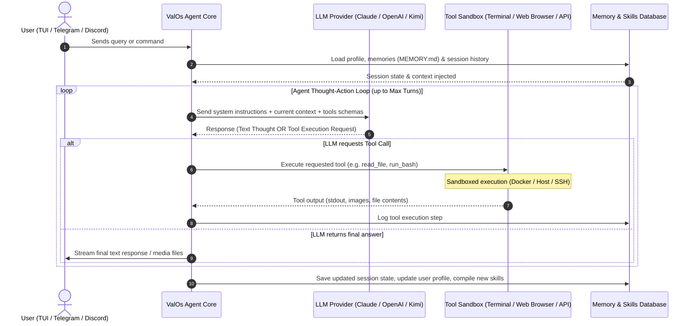
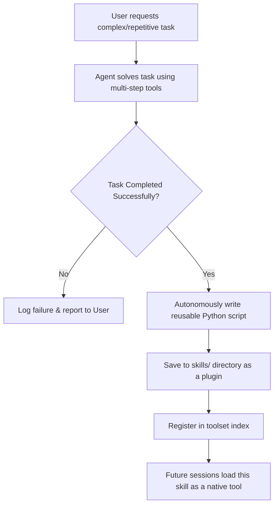
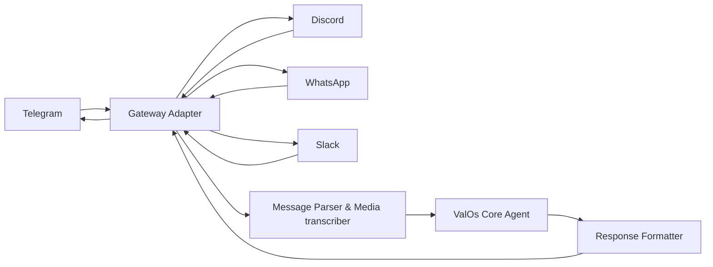
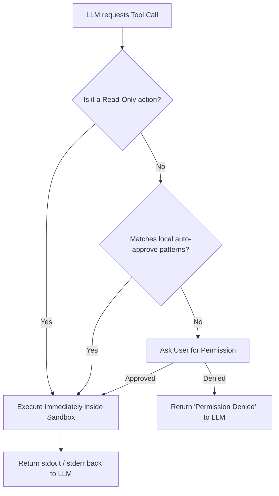

# How ValOs Works: A Visual Guide 

This document explains the inner architecture and execution flows of the ValOs agent.

---

## 1. The Core Agent Execution Loop

ValOs operates in a loop of observation, thought, action, and synthesis. It continues calling tools until the query is resolved.



---

## 2. Memory & Autonomous Skill Creation

When ValOs successfully completes a complex task, it builds a repeatable Python skill for it, forming a closed learning loop.



---

## 3. Communication Gateway Routing

The gateway processes messages from multiple platforms, translates formats, and routes them to a single agent core.



---

## 4. Sandbox Security & Command Approvals

To protect your host machine, ValOs screens actions and requests approvals for write commands.



---

## 5. Directory Mapping

Here is where the core components live in the codebase:

```
ValOs-agent/
├── agent/               # Core agent Loop logic & session managers
├── valos_cli/           # CLI wrapper, setup configs, and gateway scripts
├── tools/               # Standard built-in tools (files, browser, git)
├── skills/              # Dynamically created / custom skills
├── gateway/             # Platform connectors (Telegram, Discord, Slack)
├── landingpage/         # Landing page static site
└── website/             # Docusaurus documentation source code
```
