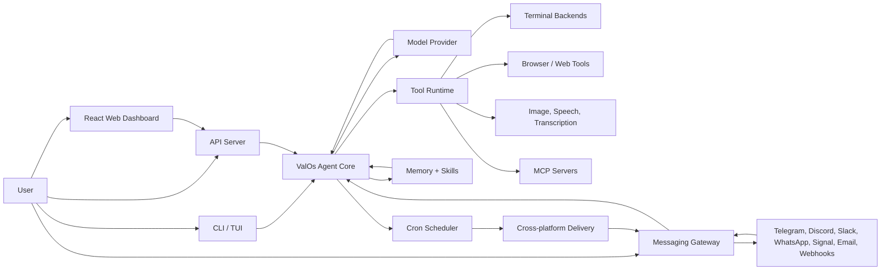

<p align="center">
  
</p>

# ValOs ☤

<p align="center">
  <a href="https://valos-agent.valos-agent.com/docs/"></a>
  <a href="https://discord.gg/horatiu.sol"></a>
  <a href="https://github.com/horatiubudai/valos-agent/blob/main/LICENSE"></a>
  <a href="https://valos-agent.com"></a>
</p>

**ValOs is the self-improving AI agent built by [ValOs](https://valos-agent.com).** It creates skills from experience, improves them during use, nudges itself to persist knowledge, searches its own past conversations, and builds a deepening model of who you are across sessions. Run it on a $5 VPS, a GPU cluster, or serverless infrastructure that costs nearly nothing when idle. It's not tied to your laptop — talk to it from Telegram while it works on a cloud VM.

Use any model you want — [ValOs Portal](https://portal.valos-agent.com), [OpenRouter](https://openrouter.ai) (200+ models), [z.ai/GLM](https://z.ai), [Kimi/Moonshot](https://platform.moonshot.ai), [MiniMax](https://www.minimax.io), OpenAI, or your own endpoint. Switch with `valos-agent model` — no code changes, no lock-in.

<table>
<tr><td><b>A real terminal interface</b></td><td>Full TUI with multiline editing, slash-command autocomplete, conversation history, interrupt-and-redirect, and streaming tool output.</td></tr>
<tr><td><b>Lives where you do</b></td><td>Telegram, Discord, Slack, WhatsApp, Signal, Matrix, Mattermost, Feishu/Lark, WeCom, SMS, Email, webhooks, Home Assistant, API Server, and CLI — all from a single gateway process. Voice memo transcription, cross-platform conversation continuity.</td></tr>
<tr><td><b>A closed learning loop</b></td><td>Agent-curated memory with periodic nudges. Autonomous skill creation after complex tasks. Skills self-improve during use. FTS5 session search with LLM summarization for cross-session recall. <a href="https://github.com/plastic-labs/honcho">Honcho</a> dialectic user modeling. Compatible with the <a href="https://agentskills.io">agentskills.io</a> open standard.</td></tr>
<tr><td><b>Scheduled automations</b></td><td>Built-in cron scheduler with delivery to any platform. Daily reports, nightly backups, weekly audits — all in natural language, running unattended.</td></tr>
<tr><td><b>Delegates and parallelizes</b></td><td>Spawn isolated subagents for parallel workstreams. Write Python scripts that call tools via RPC, collapsing multi-step pipelines into zero-context-cost turns.</td></tr>
<tr><td><b>Runs anywhere, not just your laptop</b></td><td>Six terminal backends — local, Docker, SSH, Daytona, Singularity, and Modal. Daytona and Modal offer serverless persistence — your agent's environment hibernates when idle and wakes on demand, costing nearly nothing between sessions. Run it on a $5 VPS or a GPU cluster.</td></tr>
<tr><td><b>Research-ready</b></td><td>Batch trajectory generation, Atropos RL environments, trajectory compression for training the next generation of tool-calling models.</td></tr>
</table>

---

## Quick Install

```bash
curl -fsSL https://raw.githubusercontent.com/horatiubudai/valos-agent/main/scripts/install.sh | bash
```

Works on Linux, macOS, and WSL2. The installer handles everything — Python, Node.js, dependencies, and the `valos-agent` command. No prerequisites except git.

> **Windows:** Native Windows is not supported. Please install [WSL2](https://learn.microsoft.com/en-us/windows/wsl/install) and run the command above.

After installation:

```bash
source ~/.bashrc    # reload shell (or: source ~/.zshrc)
valos-agent              # start chatting!
```

---

## Getting Started

```bash
valos-agent              # Interactive CLI — start a conversation
valos-agent model        # Choose your LLM provider and model
valos-agent tools        # Configure which tools are enabled
valos-agent config set   # Set individual config values
valos-agent gateway      # Start the messaging gateway (Telegram, Discord, WhatsApp, etc.)
valos-agent setup        # Run the full setup wizard (configures everything at once)
valos-agent claw migrate # Migrate from OpenClaw (if coming from OpenClaw)
valos-agent update       # Update to the latest version
valos-agent doctor       # Diagnose any issues
```

📖 **[Full documentation →](https://valos-agent.valos-agent.com/docs/)**

## Visual Flow



ValOs accepts work from the terminal, the React dashboard, messaging platforms, webhooks, or API clients. Every entry point routes into the same agent core, which chooses a model, calls tools, reads memory and skills, and can deliver results back through the gateway or scheduled automations.

## CLI vs Messaging Quick Reference

ValOs has two entry points: start the terminal UI with `valos-agent`, or run the gateway and talk to it from Telegram, Discord, Slack, WhatsApp, Signal, Matrix, Mattermost, Feishu/Lark, WeCom, SMS, Email, webhooks, Home Assistant, or an OpenAI-compatible API client. Once you're in a conversation, many slash commands are shared across both interfaces.

| Action | CLI | Messaging platforms |
|---------|-----|---------------------|
| Start chatting | `valos-agent` | Run `valos-agent gateway setup` + `valos-agent gateway start`, then send the bot a message |
| Start fresh conversation | `/new` or `/reset` | `/new` or `/reset` |
| Change model | `/model [provider:model]` | `/model [provider:model]` |
| Set a personality | `/personality [name]` | `/personality [name]` |
| Retry or undo the last turn | `/retry`, `/undo` | `/retry`, `/undo` |
| Compress context / check usage | `/compress`, `/usage`, `/insights [--days N]` | `/compress`, `/usage`, `/insights [days]` |
| Browse skills | `/skills` or `/<skill-name>` | `/skills` or `/<skill-name>` |
| Interrupt current work | `Ctrl+C` or send a new message | `/stop` or send a new message |
| Platform-specific status | `/platforms` | `/status`, `/sethome` |

For the full command lists, see the [CLI guide](https://valos-agent.valos-agent.com/docs/user-guide/cli) and the [Messaging Gateway guide](https://valos-agent.valos-agent.com/docs/user-guide/messaging).

---

## Documentation

All documentation lives at **[valos-agent.valos-agent.com/docs](https://valos-agent.valos-agent.com/docs/)**:

| Section | What's Covered |
|---------|---------------|
| [Quickstart](https://valos-agent.valos-agent.com/docs/getting-started/quickstart) | Install → setup → first conversation in 2 minutes |
| [CLI Usage](https://valos-agent.valos-agent.com/docs/user-guide/cli) | Commands, keybindings, personalities, sessions |
| [Configuration](https://valos-agent.valos-agent.com/docs/user-guide/configuration) | Config file, providers, models, all options |
| [Messaging Gateway](https://valos-agent.valos-agent.com/docs/user-guide/messaging) | Telegram, Discord, Slack, WhatsApp, Signal, Matrix, Mattermost, Feishu/Lark, WeCom, SMS, Email, webhooks, Home Assistant, API Server |
| [Security](https://valos-agent.valos-agent.com/docs/user-guide/security) | Command approval, DM pairing, container isolation |
| [Tools & Toolsets](https://valos-agent.valos-agent.com/docs/user-guide/features/tools) | 40+ tools, toolset system, terminal backends |
| [Skills System](https://valos-agent.valos-agent.com/docs/user-guide/features/skills) | Procedural memory, Skills Hub, creating skills |
| [Memory](https://valos-agent.valos-agent.com/docs/user-guide/features/memory) | Persistent memory, user profiles, best practices |
| [MCP Integration](https://valos-agent.valos-agent.com/docs/user-guide/features/mcp) | Connect any MCP server for extended capabilities |
| [Cron Scheduling](https://valos-agent.valos-agent.com/docs/user-guide/features/cron) | Scheduled tasks with platform delivery |
| [Context Files](https://valos-agent.valos-agent.com/docs/user-guide/features/context-files) | Project context that shapes every conversation |
| [Architecture](https://valos-agent.valos-agent.com/docs/developer-guide/architecture) | Project structure, agent loop, key classes |
| [Contributing](https://valos-agent.valos-agent.com/docs/developer-guide/contributing) | Development setup, PR process, code style |
| [CLI Reference](https://valos-agent.valos-agent.com/docs/reference/cli-commands) | All commands and flags |
| [Environment Variables](https://valos-agent.valos-agent.com/docs/reference/environment-variables) | Complete env var reference |

---

## Migrating from OpenClaw

If you're coming from OpenClaw, ValOs can automatically import your settings, memories, skills, and API keys.

**During first-time setup:** The setup wizard (`valos-agent setup`) automatically detects `~/.openclaw` and offers to migrate before configuration begins.

**Anytime after install:**

```bash
valos-agent claw migrate              # Interactive migration (full preset)
valos-agent claw migrate --dry-run    # Preview what would be migrated
valos-agent claw migrate --preset user-data   # Migrate without secrets
valos-agent claw migrate --overwrite  # Overwrite existing conflicts
```

What gets imported:
- **SOUL.md** — persona file
- **Memories** — MEMORY.md and USER.md entries
- **Skills** — user-created skills → `~/.valos-agent/skills/openclaw-imports/`
- **Command allowlist** — approval patterns
- **Messaging settings** — platform configs, allowed users, working directory
- **API keys** — allowlisted secrets (Telegram, OpenRouter, OpenAI, Anthropic, ElevenLabs)
- **TTS assets** — workspace audio files
- **Workspace instructions** — AGENTS.md (with `--workspace-target`)

See `valos-agent claw migrate --help` for all options, or use the `openclaw-migration` skill for an interactive agent-guided migration with dry-run previews.

ValOs also carries an OpenClaw-inspired channel registry. Supported ValOs adapters remain the channels above; additional OpenClaw channels are registered as planned integration targets: Google Chat, iMessage/BlueBubbles, IRC, Microsoft Teams, LINE, Nextcloud Talk, Nostr, Synology Chat, Tlon, Twitch, Zalo, WeChat, and WebChat. Planned channels are visible to the gateway architecture but do not connect until a ValOs adapter is implemented.

---

## What ValOs is Good At

ValOs is designed for developers who want a persistent, autonomous assistant that gets smarter over time and is accessible from anywhere.

*   **Self-Improving Memory & Skill Building**: Unlike standard chatbots, ValOs remembers context across sessions. When it encounters a complex task that it successfully solves, it can autonomously write a Python script as a new reusable skill, commit it, and refine it over time.
*   **Omnipresent Communication Gateway**: Talk to your agent through a rich Terminal UI, or connect it to messaging services like Telegram, Discord, WhatsApp, Slack, Matrix, or email. You can run tasks from your phone while on the go, or set up webhooks and Home Assistant integrations.
*   **Background Cron Automations**: Schedule recurring jobs in natural language. For example, have ValOs check your repositories for issues, scrape a webpage for updates, generate daily reports, or perform audits, and deliver the summaries to your chat client of choice.
*   **Sandbox Security & Flexibility**: Run the agent directly on your host machine, sandbox it in Docker containers, or run it serverless using Daytona or Modal. When idle, serverless backends hibernate to near-zero cost, waking up instantly when a message arrives.
*   **Parallel Execution**: Delegate complex pipelines to concurrent subagents or call tools via RPC using Python scripts.

---

## How to Use ValOs

### 1. Interactive Development & Coding
Launch the Terminal UI inside any codebase:
```bash
valos-agent
```
Ask it to run tests, find bugs, execute git commits, or write files. It requests permission for write operations, ensuring you stay in control.

### 2. Messaging & Remotely Controlling your Agent
Set up the Gateway process to access your agent via Telegram or Discord:
```bash
valos-agent gateway setup
valos-agent gateway start
```
From your messaging app, you can:
*   Ask it to summarize a PDF or transcribe a voice memo.
*   Run bash commands or git checks.
*   Check on long-running tasks while you are away from your computer.

### 3. Creating Background Pipelines (Cron)
Ask ValOs to schedule a recurring automation:
*   *"Check my GitHub PRs every weekday at 9 AM and message me the summary on Slack."*
*   *"Run a security scan on this directory every Sunday at midnight."*
ValOs translates these into cron entries and handles the execution and delivery.

### 4. Custom Skill Development
If you have a workflow you repeat often (like deploying a specific project or format transformation), ask ValOs:
*   *"Create a skill called `deploy-app` that runs these commands..."*
ValOs will package it as an executable Python plugin that is permanently added to its tool list.

---


## Contributing


We welcome contributions! See the [Contributing Guide](https://valos-agent.valos-agent.com/docs/developer-guide/contributing) for development setup, code style, and PR process.

Quick start for contributors:

```bash
git clone https://github.com/horatiubudai/valos-agent.git
cd valos-agent
curl -LsSf https://astral.sh/uv/install.sh | sh
uv venv venv --python 3.11
source venv/bin/activate
uv pip install -e ".[all,dev]"
python -m pytest tests/ -q
```

> **RL Training (optional):** To work on the RL/Tinker-Atropos integration:
> ```bash
> git submodule update --init tinker-atropos
> uv pip install -e "./tinker-atropos"
> ```

---

## Community

- 💬 [Discord](https://discord.gg/horatiu.sol)
- 📚 [Skills Hub](https://agentskills.io)
- 🐛 [Issues](https://github.com/horatiubudai/valos-agent/issues)
- 💡 [Discussions](https://github.com/horatiubudai/valos-agent/discussions)

---

## License

MIT — see [LICENSE](LICENSE).

Built by [ValOs](https://valos-agent.com).
